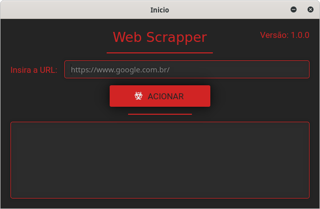

<h1 align="center">
    Web Scrappitor
</h1>

<p align="center">
 
<br>

<p align="center">
  
</p>

# Projeto
Consiste em web scrapping (extração de dados em páginas web), a ideia é tentar manipular os dados de páginas escolhidas pelo usuário.

# Ferramentas
- [PyQt5](https://pypi.org/project/PyQt5/)
- [Selenium](https://www.selenium.dev/)

# Instalação
1. #### Clonando o repositório
```git clone https://github.com/RuyVictor/web-scrappitor.git```

2. #### Acessando a pasta do projeto
```cd web-scrappitor```

3. #### Instalando as dependências
```pip install -r requirements.txt```